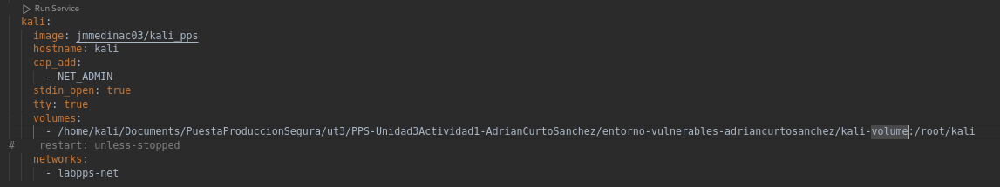

# PPS-Unidad3Actividad1-AdrianCurtoSanchez

Creación de entornos:
- [Vulnerables](#entornos-vulnerables)
- [Pruebas](#entornos-pruebas)

## Entornos vulnerables

Partiendo del fichero [docker-compose.yml](./entorno-vulnerables-adriancurtosanchez/docker-compose.yml) levantaremos las diferentes máquinas vulnerables, pero antes deberemos establecer el directorio de la máquina anfitrión donde se guadarán los datos del volumen del servicio Kali.

Ejecutaremos los servicios desde la carpeta en la que se encuentra el fichero [docker-compose.yml](./entorno-vulnerables-adriancurtosanchez/docker-compose.yml) con el comando `docker-compose up -d`.

Tras finalizar la ejecución anterior podemos verificar que los contenedores se encunetran en ejecución con el comando `docker-compose ps`.

## Entornos pruebas

